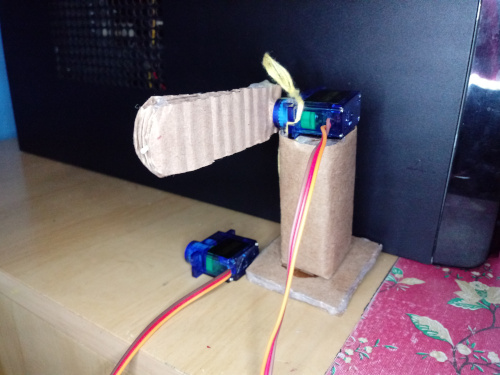
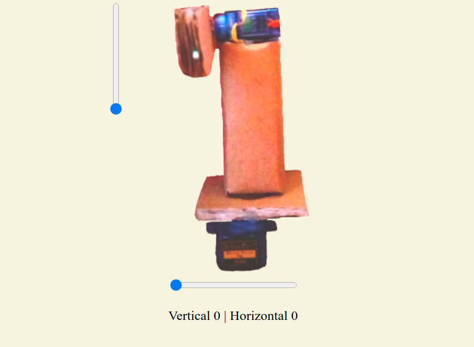

# Braço com Servos Wifi

## O que é este projeto?

Este projeto é uma adaptação do projeto [Braço com servos](https://github.com/LelePG/Arduino/tree/master/Braco_Servos), projetado por mim para a plataforma Arduino. O projeto original utiliza um módulo de joystick para movimentar os servos, e neste, o controle dos servos ocorre em uma página web que pode ser acessada da rede local. A estrutura fícisa é conectada em um servidor montado com ESP8266 que armazena uma página web que pode ser acessada de outros dispositivos na rede. Nesta página, existem controles para alterar os movimentos dos servos que compõem o braço.

## Onde este projeto foi desenvolvido?

Este projeto foi desenvolvido no plug-in [Platform.io](https://platformio.org/) da IDE Visual Studio Code. Ele também pode ser utilizado na IDE do Arduino, desde que algumas alterações sejam realizadas no arquivo main.cpp (que deve ser renomeado para um arquivo .ino). _OBS: caso você tente replicar este projeto no Platform.io e não consiga entender os valores impressos no monitor serial, certifique-se de que a cláusula `monitor_speed = 115200` está presente no arquivo `platformio.ini`._

## Como este projeto funciona?

#### Bibliotecas utilizadas:

-   ESP8266WiFi
-   ESP8266WebServer
-   ESP32Servo.h

O projeto é composto de uma página web desenvolvida de maneira independente no arquivo `index.html`, que é transformada para string no arquivo `paginaWeb.h`. Este arquivo é inserido no código principal do ESP8266 de modo que esta página seja exibida quando o endereço de IP do dispositivo for acessado em uma máquina externa.

Para adicionar a imagem na página, eu utilizei a opção de transformar a imagem em um código uri utilizando o site [ezgif](https://ezgif.com/image-to-datauri/ezgif-3-e014124f0b44.png), e para adicionar uma imagem basta copiar o código gerado pelo site e colá-lo. Esta imagem serve para mostrar a referência dos sliders (um para cada servo), e quando um destes sliders tem seu valor alterado, uma requisição é feita para o ESP de modo que ele altere a posição dos servos, e quando esta alteração é feita, um texto é atualizado mostrando os valores atuais de cada motor.
