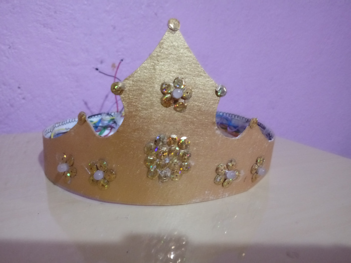

# Coroa_Led_RGB

## O que é este projeto?

Este projeto se trata de uma coroa de papelão estilizada que contém LEDs RGB. Esta coroa é conectada em um servidor montado com ESP8266 que armazena uma página web que pode ser acessada de outros dispositivos na rede. Nesta página, existem vários botões com diferentes cores, através dos quais é possível selecionar a cor dos LEDs da coroa.

## Onde este projeto foi desenvolvido?

Este projeto foi desenvolvido no plug-in [Platform.io](https://platformio.org/) da IDE Visual Studio Code. Ele também pode ser utilizado na IDE do Arduino, desde que algumas alterações sejam realizadas no arquivo main.cpp (que deve ser renomeado para um arquivo .ino). _OBS: caso você tente replicar este projeto no Platform.io e não consiga entender os valores impressos no monitor serial, certifique-se de que a cláusula `monitor_speed = 115200` está presente no arquivo `platformio.ini`._

## Como este projeto funciona?

#### Bibliotecas utilizadas:

-   ESP8266WiFi.h
-   ESP8266WebServer.h

O projeto é composto de uma página web desenvolvida de maneira independente no arquivo `index.html`, que é transformada para string no arquivo `Coroa.h`. Este arquivo é inserido no código principal do ESP 8266 de modo que esta página seja exibida quando o endereço de IP do dispositivo for acessado em uma máquina externa.
Quando um dos botões das cores é apertado, o código javascript faz uma requisição ao servidor (no caso o ESP), que ao receber esta requisição toma uma determinada ação de acordo com a requisição passada (acender/apagar um dos LEDs).

## Sobre a replicação do projeto:

Se você tem interesse em utilizar o código para alguma coisa, não precisa necessáriamente fabricar a sua coroa (a menos que você queira, é claro). O código inteiro trata de acender um único LED com os botões coloridos da página web. Como os LEDs estão ligados em paralelo, desde que você tenha um LED RGB já consegue utilizar o código. Se você quiser, também pode utilizar o código presente no projeto Quadro_RGB, que nada mais é do que uma versão sofisticada deste projeto.
