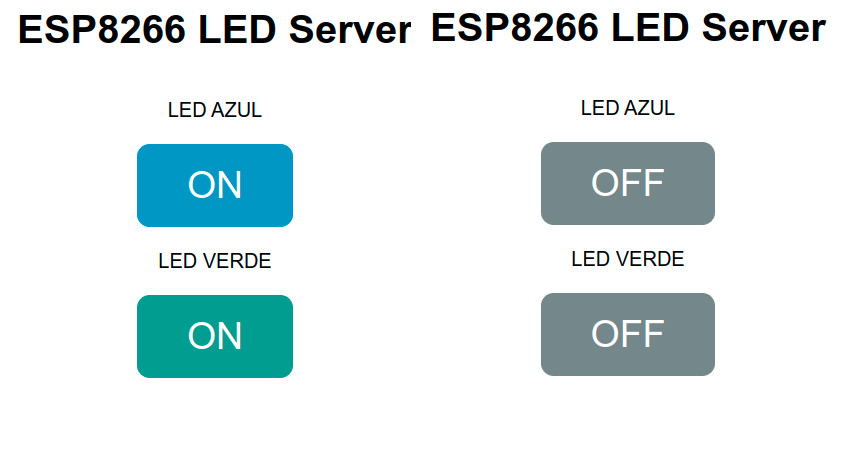
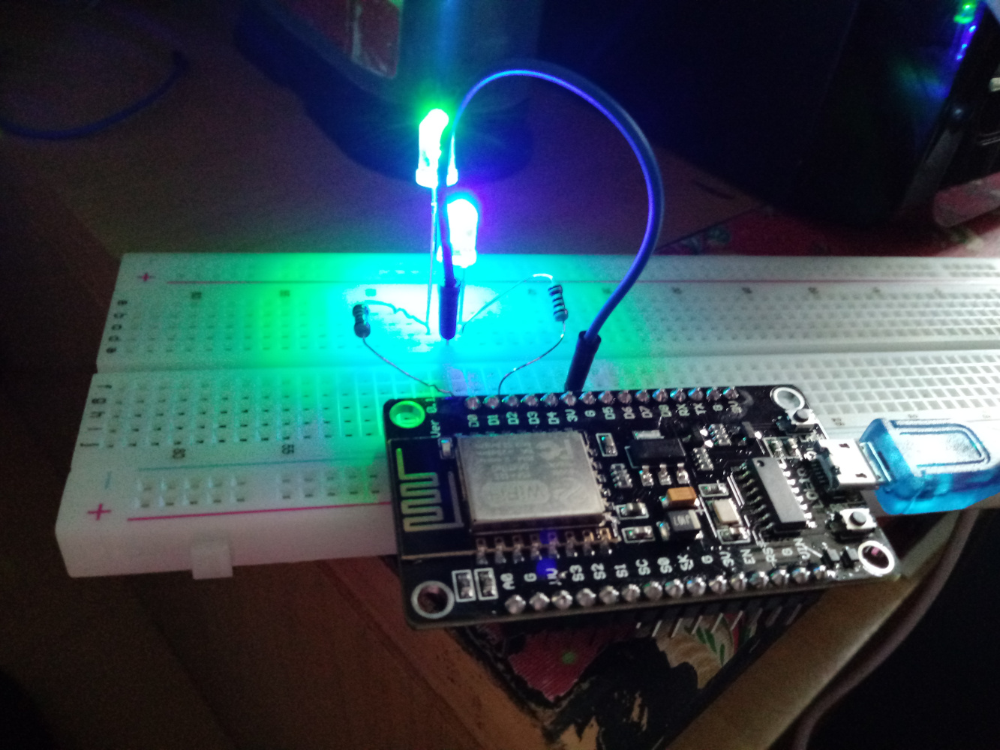

# Liga-LEDs WebServer

## O que é este projeto?
Este projeto se trata de um servidor montado com ESP8266 que armazena uma página web que pode ser acessada de outros dispositivos na rede. Nesta página, existem dois botões que podem ligar ou desligar cada um dos LEDs respectivamente.

## Onde este projeto foi desenvolvido?
Este projeto foi desenvolvido no plug-in [Platform.io](https://platformio.org/) da IDE Visual Studio Code. Ele também pode ser utilizado na IDE do Arduino, desde que algumas alterações sejam realizadas no arquivo main.cpp (que deve ser renomeado para um arquivo .ino). *OBS: caso você tente replicar este projeto no Platform.io e não consiga entender os valores impressos no monitor serial, certifique-se de que a cláusula `monitor_speed = 115200` está presente no arquivo `platformio.ini`.*

## Como este projeto funciona?
#### Bibliotecas utilizadas:
  * ESP8266WiFi.h
  * ESP8266WebServer.h

O projeto é composto de uma página web desenvolvida de maneira independente no arquivo `index.html`, que é transformada para string no arquivo `webPage.h`. Este arquivo é inserido no código principal do ESP 8266 de modo que esta página seja exibida quando o endereço de IP do dispositivo for acessado em uma máquina externa. 
Quando um dos botões é apertado, o código javascript faz uma requisição ao servidor (no caso o ESP), que ao receber esta requisição toma uma determinada ação de acordo com a requisição passada (acender/apagar um dos LEDs).

## Referências externas deste projeto
Como eu precisei fazer muitas pesquisas acerca de como realizar as requisições (inclusive tenho alguns códigos exemplos guardados na pasta Códigos-base), deixo aqui alguns links que podem ser úteis caso você queira replicar o projeto: 
* [Build an ESP8266 Web Server – Code and Schematics (NodeMCU)](https://randomnerdtutorials.com/esp8266-web-server/)
* [ESP8266 Web Server Step-By-Step Using Arduino IDE (Mac OSX and Windows)](https://www.youtube.com/watch?v=m2fEXhl70OY)
* [ESP8266 Web Server HTML, JavaScript, and AJAX Webpages Using Arduino IDE (Mac OSX and Windows)](https://youtu.be/ZJoBy2c1dPk)
* [Ligando e desligando led por via do Wifi usando ESP8266 Node MCU](https://medium.com/@valdiney/ligando-e-desligando-led-por-via-do-wifi-usando-esp8266-node-mcu-4b0ef85ce6a3)

Infelizmente, não encontrei muitos materiais em português, mas creio que todos os vídeos que indico aqui possuem legendas em português, e você pode sempre tentar pegar o código e gerar sua própria interpretação dele.
