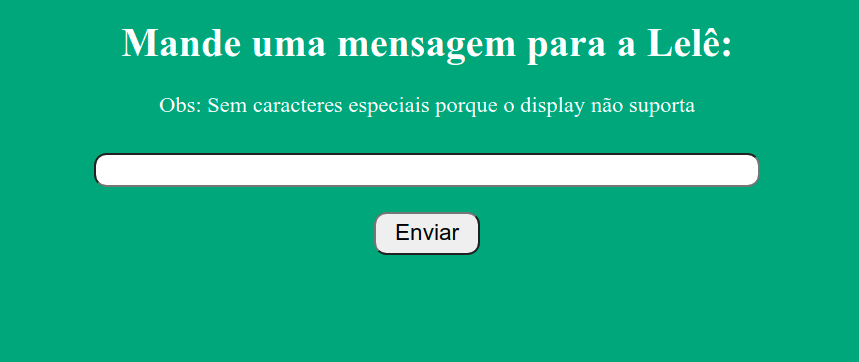
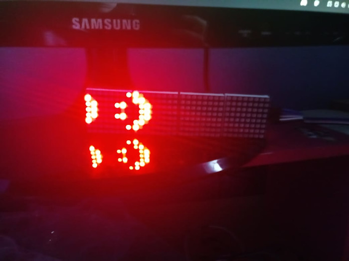

# Mensagem com matriz de LEDs

## O que é este projeto?

Este projeto se trata de uma matriz de LEDs 8X32 (mais espeficamente o modelo [MAX7219](https://images.app.goo.gl/pwzDEVaormfdvxSK6)) onde mensagens são exibidas. Essas mensagens são enviadas através de requisições web feitas na página armazenada no ESP8266, onde existe um campo de texto onde a mensagem pode ser enviada.

## Onde este projeto foi desenvolvido?

Este projeto foi desenvolvido no plug-in [Platform.io](https://platformio.org/) da IDE Visual Studio Code. Ele também pode ser utilizado na IDE do Arduino, desde que algumas alterações sejam realizadas no arquivo main.cpp (que deve ser renomeado para um arquivo .ino). _OBS: caso você tente replicar este projeto no Platform.io e não consiga entender os valores impressos no monitor serial, certifique-se de que a cláusula `monitor_speed = 115200` está presente no arquivo `platformio.ini`._

## Como este projeto funciona?

### Bibliotecas utilizadas:

-   ESP8266WiFi.h
-   ESP8266WebServer.h
-   [Altaris - ESP8266 - FC16](https://github.com/ridercz/Altairis-ESP8266-FC16) (disponível na pasta lib)
-   [LedControlSpipESP8266](https://github.com/labsud/LedControlSpipESP8266) (pré requisito para a biblioteca anterior, também disponível na pasta lib)

O projeto é composto de uma página web desenvolvida de maneira independente no arquivo `index.html`, que é transformada para string no arquivo `paginaWeb.h`. Este arquivo é inserido no código principal do ESP 8266 de modo que esta página seja exibida quando o endereço de IP do dispositivo for acessado em uma máquina externa.
Quando um dos botões das cores é apertado, o código javascript faz uma requisição ao servidor (no caso o ESP) passando a mensagem como parâmetro. Ao receber esta requisição, o servidor escreve a mensagem na matriz, e também aciona um sinal sonoro que indica que uma mensagem foi recebida.

### Pinagem

| Matriz | ESP |
| ------ | --- |
| VCC    | 3V  |
| GND    | G   |
| DIN    | D7  |
| CS     | D4  |
| CLK    | D5  |

Apenas o pino CS pode ser modificado, já que ele é definido no código. Os pinos DIN e CLK devem ser ligados em saídas específicas do ESP, sendo o pino DIN ligado ao MOSI e o pino CLK ligado ao clock.

Para a construção desse projeto, me baseei principalmente nos artigos abaixo:

-   [MAX7219 LED dot matrix display Arduino tutorial](https://www.makerguides.com/max7219-led-dot-matrix-display-arduino-tutorial/)
-   [Módulo MAX7219 com ESP8266 NodeMCU](https://www.arduinoecia.com.br/modulo-max7219-com-esp8266-nodemcu/)

A biblioteca **Altaris - ESP8266 - FC16** é suficiente para fazer este projeto, e eu recomendaria que você lesse a documentação dessa biblioteca, que é bem rápida e dá as funcionalidades básicas para a execução deste projeto.
