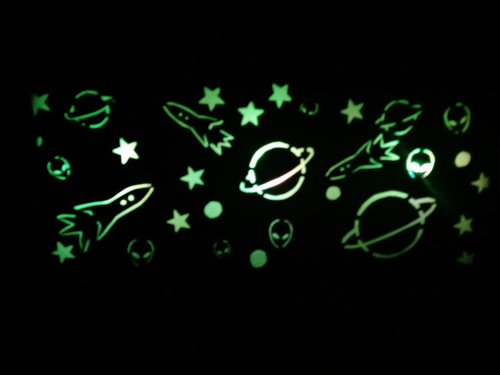
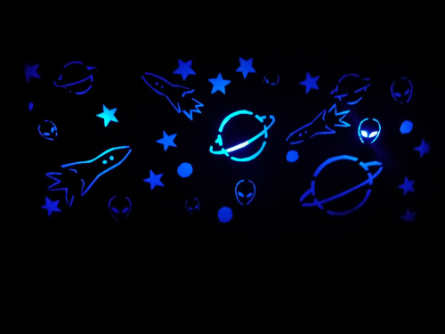

# Quadro_RGB

## O que é este projeto?
Este projeto se trata de um quadro montado com papelão com uma luz de fundo que contém LEDs RGB. O quadro é conectado em um servidor montado com ESP8266 que armazena uma página web que pode ser acessada de outros dispositivos na rede. Nesta página, existe um seletor de cores onde o usuário pode selecionar qualquer cor do espectro RGB e dois botões para ligar e desligar os LEDs. O botão de ligar inicia os LEDs com a cor branca e o de desligar desliga todos os LEDs.  

## Onde este projeto foi desenvolvido?
Este projeto foi desenvolvido no plug-in [Platform.io](https://platformio.org/) da IDE Visual Studio Code. Ele também pode ser utilizado na IDE do Arduino, desde que algumas alterações sejam realizadas no arquivo main.cpp (que deve ser renomeado para um arquivo .ino). *OBS: caso você tente replicar este projeto no Platform.io e não consiga entender os valores impressos no monitor serial, certifique-se de que a cláusula `monitor_speed = 115200` está presente no arquivo `platformio.ini`.*

## Como este projeto funciona?
#### Bibliotecas utilizadas:
  * ESP8266WiFi.h
  * ESP8266WebServer.h

O projeto é composto de uma página web desenvolvida de maneira independente no arquivo `index.html`, que é transformada para string no arquivo `paginaWeb.h`. Este arquivo é inserido no código principal do ESP 8266 de modo que esta página seja exibida quando o endereço de IP do dispositivo for acessado em uma máquina externa. 
Quando um dos botões das cores é apertado, o código javascript faz uma requisição ao servidor (no caso o ESP), que ao receber esta requisição toma uma determinada ação de acordo com a requisição passada (acender/apagar/setar a cor de um LED).
